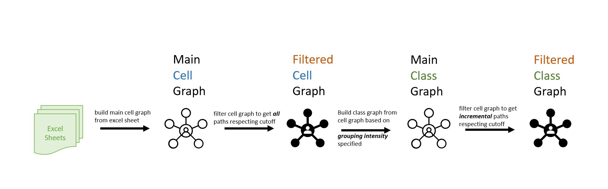
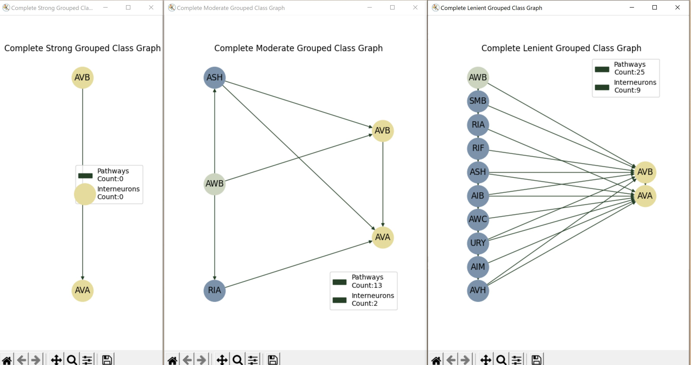
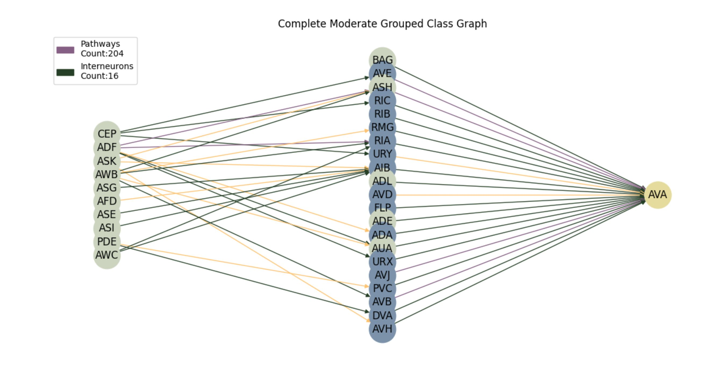

# C. Elegans Wiring
Study the connectome structure in C. Elegans by finding paths between a set of neuron classes present.

## Installation

- set up a virtual environment following the instructions in this [link](https://packaging.python.org/en/latest/tutorials/packaging-projects/)

- This package can be installed in two ways

  - to install from pip, run the command 

    ```bash
    pip install ...
    ```

  - to install from the cloned repository, running the following command after downloading the repository from this link

    ```bash
    python setup.py install
    ```

## Usage

As of now, the CElegans Wiring package only contains the `search` module

### `Search` module

- The search module is used to search through the C Elegans wiring graph for `synapses` between a list of `from neuron classes` to a list of `to neuron classes` and filter the wiring network.

- There are two filtering options provided

#### get_filtered_cell_graph

- to filter the C Elegans wiring graph and obtain a filtered graph network that is shown in the `neuron cell` representation

##### Required Inputs

- `from_nodes_class`: a list of neuron classes as the start node of the search
- `to_nodes_class`: a list of neuron classes as the end node of the search 
- `max_cutoff`: maximum distance between the from node and to node *(2 by default)*
- `synapse_types`: specify a list of the synapse types that we want to consider *(['chemical', 'electric'] by default)*
  - As of now, the tool supports two types of synapses
    - `chemical` synapses
    - `electric` synapses


#### Outputs

- this api call returns a `network graph object ` by default 
- to plot the graphs in matplotlib, also pass the argument `view_graph=True` while calling the function
- `output_folder`: path to the location where the output files need to be stored (*None by default*)
  - when the output folder is specified, the following details will also be saved to the directory chosen
    - interneurons
    - path
    - dot file

##### Example Usage

```python
from c_elegans_wiring import search

search.get_filtered_cell_graph(
  from_nodes_class=['AWB'], to_nodes_class['AVA','AVB'],
  view_graph=True,
  output_folder='Documents/IUB/projects/connectome/github')
```

#### get_filtered_class_graph

- to filter the C Elegans wiring graph and obtain a filtered graph network that is shown in the `neuron class` representation

##### Required Inputs

- `from_nodes_class`: a list of neuron classes as the start node of the search
- `to_nodes_class`: a list of neuron classes as the end node of the search 
- `max_cutoff`: maximum distance between the from node and to node
- `cgi`: class grouping intensity
  - this specifies how tightly coupled the synapses between neurons need to be if we need to consider that as an edge on the graph(add diagrams in wiki)
    - `1` -> <u>Strongly Coupled</u> : *should have all possible combinations from source cells to target cells*
    - `2` -> <u>Moderately Coupled</u> (default):*All cells from source connect to at least one cell from target class*
    - 3 -> <u>Lenient</u>: *Any one cell in from class, connect to at least 1 cell from target class*


#### Outputs

- this api call returns a `network graph object ` by default 
- to plot the graphs in matplotlib, also pass the argument `view_graph=True` while calling the function
- `output_folder`: path to the location where the output files need to be stored (*None by default*)
  - when the output folder is specified, the following details will also be saved to the directory chosen
    - number of connections in and out of the inter-neurons will be stored with a prefix of `NEURON_INFO_`
    - paths between from and to classes under will be stored with a prefix of `PATH_`
    - Dot files of the networkx graph will be stored with a prefix `DOT_`

##### Example Usage

```python
from c_elegans_wiring import search

search.get_filtered_class_graph(
  from_nodes_class=['AWB'], to_nodes_class=['AVA', 'AVB'], 
  output_folder='Documents/IUB/projects/connectome/github')
```


## Color Scheme Defined

- When the networkx graph is viewed with matplotlib, the following convention has been chosen
- `Edges`
  - Depending on the types of sub edges(synapses) between the neuron cells when they are grouped to classes,
  - `green` : if all edges between the corresponding classes are  **Chemical** 
  - `yellow` :  if all edges between the corresponding classes are **Electric**
  - `purple` :  if there are both **Chemical** and **Electrical** edges between the corresponding classes

## Dependencies

> Except graphviz, all the other dependencies will be auto installed when you install the package

- GraphViz -> https://graphviz.org/download/
- Pydot
- Networkx
- Pandas
- Openpyxl

## Screenshots

### Architecture

> For more details on what happens in the tool, refer the `wiki` section on GitHub



### Sample Run 1




### Sample Run 2



## Motivations

While talking of studying connectome maps, we intend to identify the synapses and interneurons between source and target neurons, lesion/kill certain interneurons and study if the resultant network has any impact on function(based on the connections between sensory and motor neurons). We intend to study how important a neuron class is for a particular behavior/ability/function. To do this, we need to consider how strong a neuron is, in terms of the number of neuron synaptic connections at the junction. We need to find, common path between multiple source and target neuron classes which can help us discover the critical synapses that connect multiple related classes or clusters of neurons. 

Since the adjacency matrices and connectome maps are defined `neuron cell` wise, but most insights are derived `neuron class` wise, there are various ways we have to analyze how the cells are grouped to classes. It is very hard to understand the overall nature of the connectome by just directly looking at the neuron cells as there are so many connections and it gets very hard to track. So, the cell graph first needs to be built based on the adjacency matrices, then the cells need to be grouped to classes based on the requirements and then we can analyze the paths. 


The synapses and their corresponding weights are specified in `adjacency matrices`, with each `synapse type` having its own `excel sheet`.  If we try finding these interneurons and paths by hand, it would get very cumbersome, tedious and complicated, since we will have to iteratively search connections from source step by step and `finding paths that exists passing through different synapse types`. So we need to find a way to ensure we can find a way to find such paths more efficiently. 

## Data Source

All input data for the C elegans adjacency weights were sourced from https://wormwiring.org/


## Future Developments

- dynamic graph filtering with [D3.js](https://d3js.org)
- As of now, the tool only offers filtering and viewing capabalities on the C Elegans Worm Wiring Diagram. This can be extended to provide more functionalities to study the C Elegans Connectome maps.

## Credits

The entire project was done under the guidance of Professor Eduardo J Izquierdo at Indiana University Bloomington. I hope that I could be as lively, enthusiastic, and energetic as him in the projects I get to work on. None of this would have been possible if not for his support, ideas, patience and freedom given. Thank You!